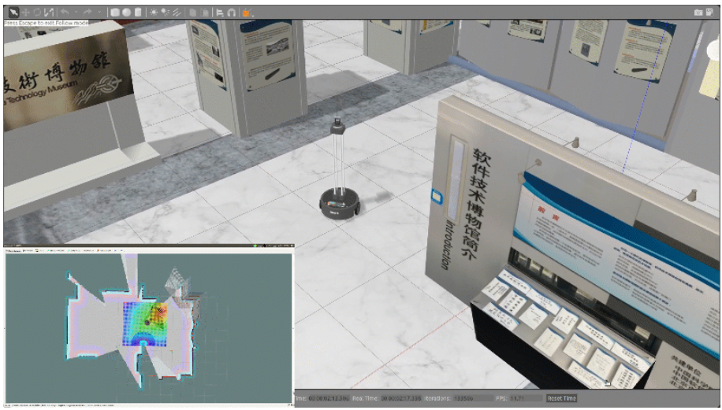

# MOOC 机器人操作系统入门

## 相关笔记：

https://ran.moe/icourse163-learning-ros/

## 官方资源：

https://www.icourse163.org/course/ISCAS-1002580008

**本课程配套教学资料：**

1 [**《机器人操作系统入门》课程讲义**](https://sychaichangkun.gitbooks.io/ros-tutorial-icourse163/content/)**---Gitbook**    可在线阅读或下载pdf，不断更新中

2 [**《机器人操作系统入门》代码示例**](https://github.com/DroidAITech/ROS-Academy-for-Beginners)**---Github**     教学代码示例，长期维护

3 [**ROS WIKI**](https://wiki.ros.org/)          官方网站，文档齐全

4 [**古月居博客**](https://www.guyuehome.com/)          ROS学习博客