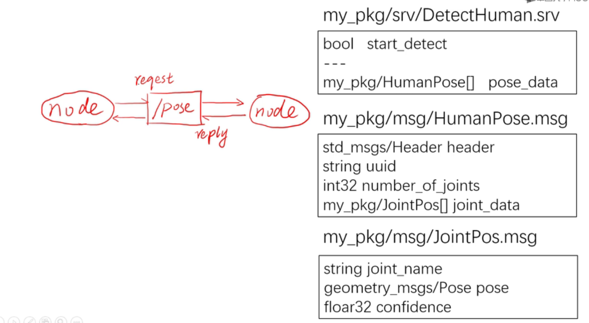

# 1. ROS通信架构


上图为 Personal Robot 的配置（传感器、电机、处理器等）， 

一个机器人上集成**如此多零部件**，***这些零部件之间是如何协作的呢？***

相信如果你学过 Operating System ， 把每个零部件抽象化为**一个进程**， 进程之间可以通过一些机制来交换数据。其中负责进程之间通信 (IPC) 通常都是操作系统。

那么机器人的操作系统是什么呢？没错 ROS (Robot Operating System). 

类似 Linux 中的元祖进程 ` /sbin/init` , 此进程会通过 `fork()` 启动其他 child processes. 

在 ROS 类似的核心进程叫 ***master*** 。


### 1.1 Master

- 每个 node 启动时都要向 master 注册
- 管理 node 之间的通信

可以允许以下代码启动 ROS master 

```bash
roscore
```

还会顺便启动另外两个东西

- rosout : 日志输出的节点(node)
- parameter server : 参数服务器


### 1.2 Node

- node is a ***process***
	- node is a running instance of *an executable file in a package*
	- (there may be *multiple executable files in a package*). 
- 把机器人的零部件抽象化为进程（比如摄像头是一个 node）
- Four types of node: **publisher**, **subscriber**, **service**, **action**. 

要启动一个 node 

```bash
rosrun [pkg_name] [node_name]
```

查看当前运行的 nodes

```
rosnode list
```

显示某个 node 的详细信息

```
rosnode info [node_name]
```

结束某个 node 

```
rosnode kill [node_name]
```

查看 node 之间的关系

```
rqt_graph
```

如果你写 ROS project **包含一堆nodes** (比如上面的机器人，有摄像头、雷达、电机、压感器等等)， 每个 node 都启动一下就太麻烦了，怎么办？

```bash
roslaunch [pkg_name] [file_name.launch]
```

其中 `launch` 文件就是为了快速启动的。


Personal Robot 2 启动时可能会牵涉到一下文件。。。


可以一键启动 (其中 *bringup* 是 naming convention ，没有什么特别意义)

```bash
roslaunch pr2_bringup pr2.launch
```


#### 1.2.1 Publisher

- a node that *product contents* and then *send processed data* to other nodes via *topics*. 
- The publisher will update the topic at a specified frequency (for example, *10 Hz, 10 times per second*) . 
- For example, a small block that processes raw information from sensors like camera, encoders. 


#### 1.2.2 Subscriber

- a node that receives information via *topics*.
- Use a *"callback function"* to process received information (*the concept of "callback" is similar to JavaScript* or *interrupt service of CPUs)*.   
	- Because callback function is an interrupt service, *it is only executed if new data is published*. 
- For example, the water level of a tank is lower than a specified value.  


### 1.3 Message between Nodes

#### 1.3.1 Topic

- ROS 中的异步通信方式
	- Topic 类似 C 语言中的 `struct` 是一种数据结构。 
	- 异步通信指的是类似 UDP 的通信机制（比如一直无脑发送，不会等待 ACK 的接受确认信息）
- 通过 *publish-subscribe* 机制通信 
	- (***可以把 Topic 理解为公告栏***， **多个 Node 可以在同一个公告栏发布自己的消息**， 然后其他 Node 要订阅这个公告栏才能及时收到信息(比如手机提醒， 类似操作系统的 *Interrupt*))。  
	- 可以多个节点同时订阅同一个 topic 。
	- 可以多个节点同时往同一个 topic 上写入信息。
- Topic内容的数据类型由 Message 定义
	- Message 类似编程中的 `struct` , 新一个消息就是一个 instance 
	- Primitive types of *msg*: `bool`, `int8`, `int16`, `int32`, `int64`, `unit`, `float32`, `float64`, `string`, `time`, `duration`, `header`, `array[]` 和 `arracy[C]`
		- 其中 `array[]` 为可变长度数组 (类似 C++ 的 `vector<T>` )， `array[C]` 为固定长度数组。
	- 例子: image的 Message类型
		- 
		- **要注意 topic 一般都以斜杠为开头**(看后面的命令演示)。

列出当前所有 topic 

```
rostopic list 
```

显示某个 topic的属性信息

```
rostopic info /topic_name
```

显示某个 topic 的具体内容

```
rostopic echo /topic_name
```

向某个 topic 发布内容 (覆盖写入)

```
rostopic pub /topic_name ...
```

##### 1.3.1.1 Topic & msg

Topic 信息的数据类型通常由 `msg` 定义。

查看本机上所有可用的 Message 类型

```
rosmsg list
```

查看 Message 是怎么定义的 (都含有什么 primitive 数据类型)

```
rosmsg show /msg_name
```


#### 1.3.2 Service 

- ROS 中的同步通信方式
- 同步通信指的是**类似 HTTP 的通信机制**（即 Node之间的 Request-Response 的***On-demand机制***）
	- HTTP的同步通信是会阻塞的。 ***ROS的 Service 也会阻塞***。
- 一些 Node 比较消耗计算资源 (比如 Human Pose Estimation 用 CNN) ， 用 Service 这种 On-demand 的方法可以收到请求的时候才发出***类 Topic 的消息*** (节约了大量无意义的计算)。
- 或者一些偶尔使用的 Node 也可以用 Service 通信。


(Node B 的 Server 跟传统意义上的服务器差不多)


( *callback* 一般是*本地函数*的回调（同一个进程里），*Remote Procedure Call* 是*一个进程调用另一个进程*的函数（两个不同的进程） )

列出当前活跃的 service 

```
rosservice list
```

显示某个 service 的属性信息

```
rosservice info service_name
```

调用某个 service 

```
rosservice call service_name args 
```


##### 1.3.2.1 Service & srv

Service 信息的数据类型通常由 `srv` 定义。注意这里查看数据类型的定义。

列出系统所有 `src`

```
rossrv list 
```

显示某个 srv 内容

```
rosrv show srv_name
```

##### 1.3.2.2  Example : human pose estimation 



- `bool start_detect` 代表*请求*的类型
- `my_pkg/HumanPose[] pose_data` 代表返回的数据类型 (返回一个 msg类型的数组，因为可能检测到很多个人)
- 

  

#### 1.3.3 Parameter Service


#### 1.3.4 Actionlib 


