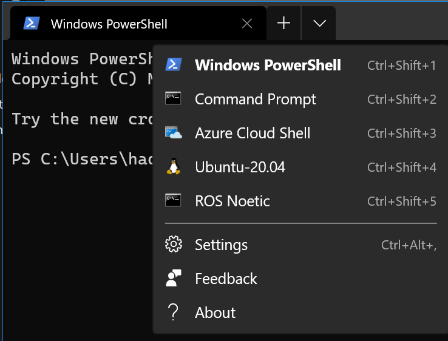
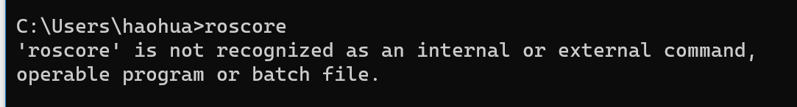
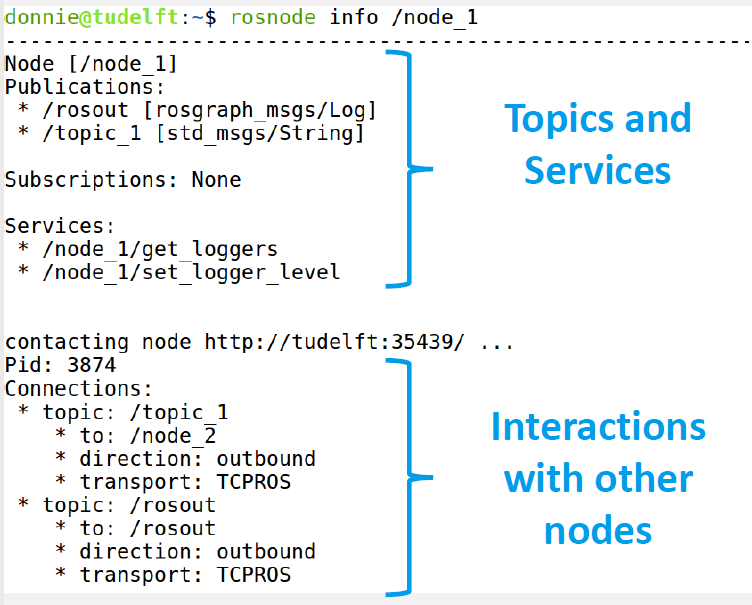
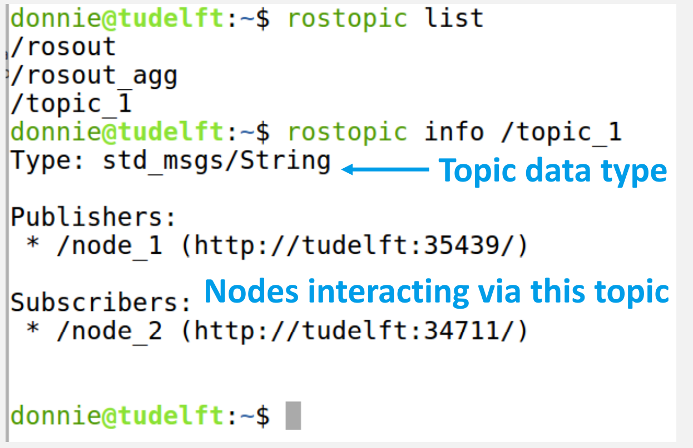
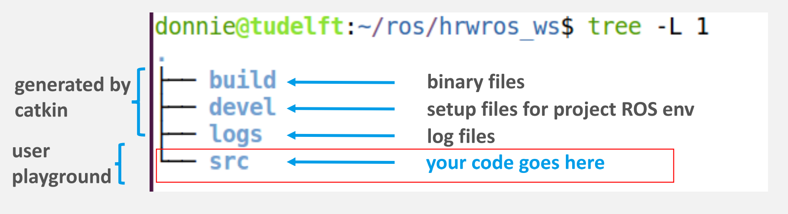

# Week 0 - ROS setup 

## Setup ROS 

Install ROS on windows (natively, instead of WSL). 

[Installation/Windows - ROS Wiki](http://wiki.ros.org/Installation/Windows)

Then run `setup.bat` . 

[ROS探索总结（五十五）—— Windows版ROS安装试用 – 古月居 (guyuehome.com)](https://www.guyuehome.com/2192)

Install *Windows Terminal application*. 



Follow the instruction http://wiki.ros.org/Installation/Windows

Don't forget create a new file `go2ros.bat`

```
chdir /d C:\opt\ros\noetic\x64\
```

And add it to the `setting.json` in the *Windows Terminal* application, it will change the current directory to the ROS directory. 

But if you have your own project, modify the `C:\opt\ros\noetic\x64\` to the path of your own project. 


# Week 1 ROS Essential 

Some basic concepts in ROS 

## Node and Topic 

- ***Node***
  - The minimum unit of execution to *process data/information*.
  - Similar to the concept of ***class*** in Object-Oriented Programming.   
  - Four types of node
  	- Publisher
  		- a node that *product contents* and then *send processed data* to other nodes via *topics*. 
  		- The publisher will update the topic at a specified frequency (for example, *10 Hz, 10 times per second*) . 
  		- For example, a small block that processes raw information from sensors like camera, encoders. 
  	- Subscriber
  		- a node that receives information via *topics*.
  		- Use a *"callback function"* to process received information (*the concept of "callback" is similar to JavaScript* or *interrupt service of CPUs)*.   
  			- Because callback function is an interrupt service, *it is only executed if new data is published*. 
  		- For example, the water level of a tank is lower than a specified value.  
  	- Services
  		- 
  	- Actions
  		- 
- ***Topic***
	
	- a pipe between nodes for *information transport*. 
	
	- Similar to the `struct` in C language, it is basically a collection of different data types such as strings, integers, floating point numbers.  Each topic is like a variable, it has a *name* and a *type*. 
	
	- A topic can only have one value, but *multiple nodes* can publish to this topic.
	
		


## Run Turtle Example on ROS

[理解简单海龟模拟程序 - 知乎 (zhihu.com)](https://zhuanlan.zhihu.com/p/139373947)

Setup ROS Environment in a new terminal (but this is usually in *windows terminal*, so don't worry). 

```
C:\opt\ros\noetic\x64\setup.bat
```

Once you setup the ROS Environment, you can directly run ROS commands ( try to run `roscore` in the normal terminal) . 



launch ROS master (make sure that you run `setup.bat`). 

```
roscore
```

 Open another terminal, turtle simulation node 

```
rosrun turtlesim turtlesim_node
```

Open another terminal, turtle keyboard controller node 

```
rosrun turtlesim turtle_teleop_key
```

Try to press the arrow key on the `turtle_teleop_key` node. 

To understand the relationship between nodes, open another terminal, run the command.

```
rqt_graph
```

(make sure that you have installed *graphviz* and `choco install graphviz` does the same thing as `apt-get`, remember add the path to the environment variables). 

You could also list all nodes 

```
rosnode list
```

(其中`rosout`是ros执行的, 用来存储其他节点的日志信息。)

To specify a node 

```
rosnode info <node_name>
```



You could also list all topics 

```
rostopic list
```



Topic data structure 

```
rostopic info <topic_name>
```

Print *topic contents* on the terminal (a *loop* and print at each second)

```
rostopic echo <topic_name>
```


## Start a ROS Project 

### catkin Workspace 

catkin - a build tool that compiles source files to binaries. 



To get started, create a new folder (including the subfolder `src`) in arbitrary location.  

```
mkdir -p ~/Doucments/new_ros_project/src
```

Setup the ROS Environment in the workspace so that you can run ROS command in the workspace 

```
C:\opt\ros\noetic\x64\setup.bat
```

Then initialize the workspace with catkin build tool, 

```
catkin init
```

And run 

```
catkin build
```

to handle all other tedious things for us. 


## Create Nodes in Python 

### Publisher Node 

### Subscriber Node 

