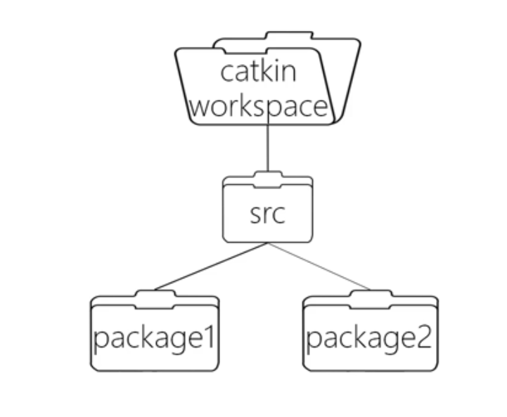
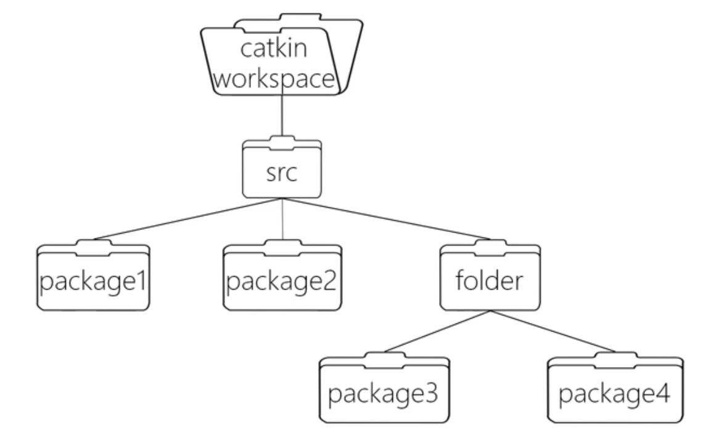
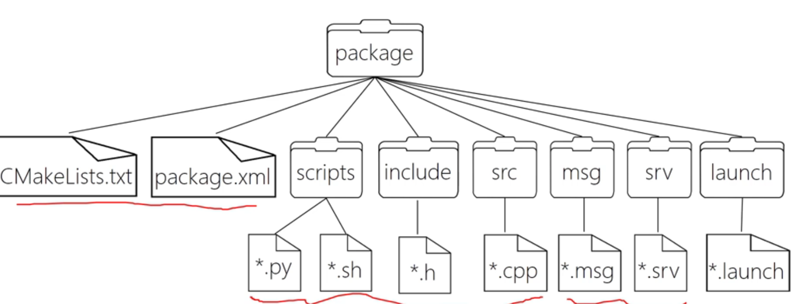
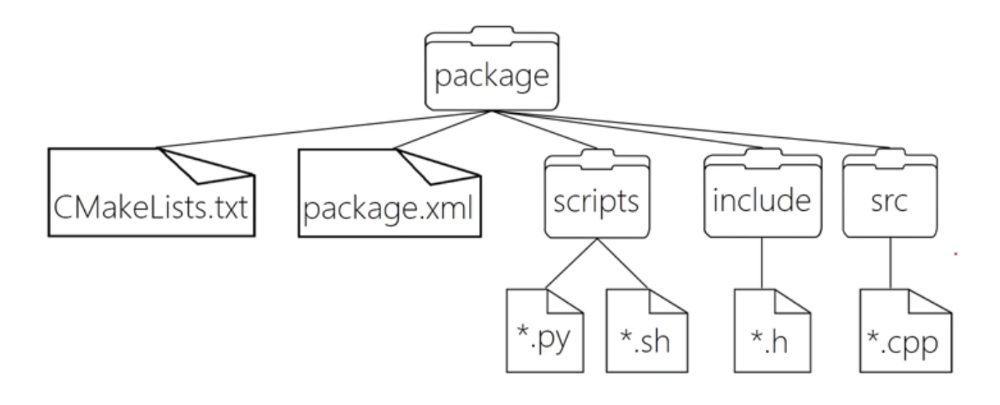
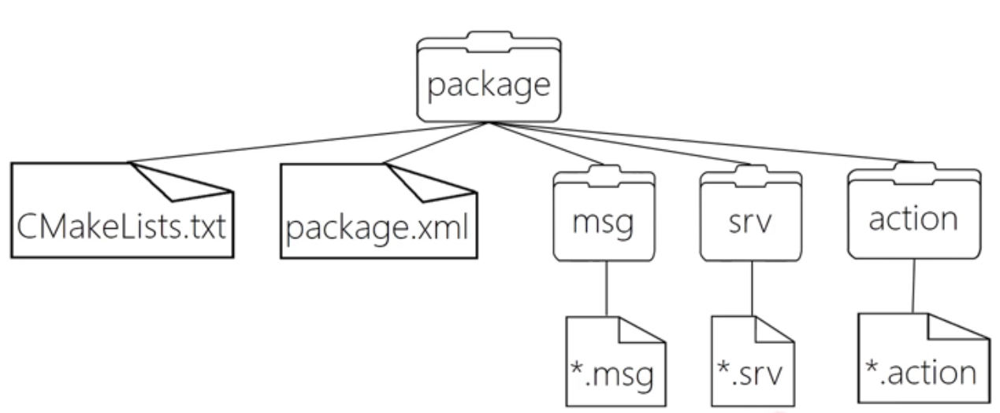
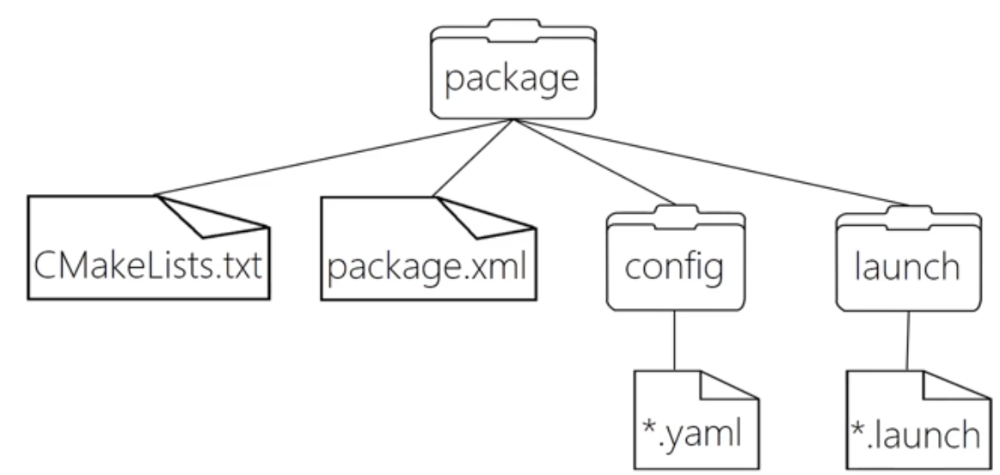
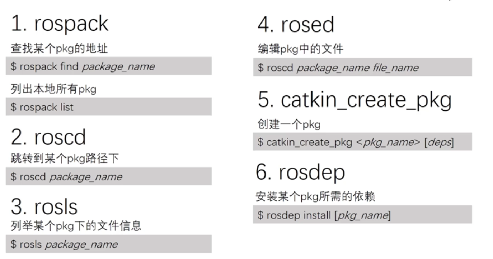

# 1. 什么是ROS

目前越来越多的机器人、无人机甚至无人车都开始采用ROS作为开发平台。

以前，开发一个机器人需要花很大的功夫，你需要设计**机械**、画**电路板**、写**驱动程序**、**设计通信架构**、组装集成、调试、以及编写各种感知决策和控制算法，每一个任务都需要花费大量的时间。

如今的电机、底盘、激光雷达、摄像头、机械臂等等元器件都有不同厂家专门生产。社会分工加速了机器人行业的发展。而各个部件的集成就需要一个统一的**软件平台**，在机器人领域，这个平台就是机器人操作系统ROS。


## 1.1 ROS特点

- **分布式 - 点对点 (Node to Node)** 
	- ROS采用了**分布式的框架**，通过点对点的设计**让机器人的进程可以分别运行**，便于模块化的修改和定制，提高了系统的容错能力。
- 缺点
	- 通信实时性能有限
	- 系统稳定性尚不满足工业级要求

总体来说，ROS更适合科研和开源用户使用，


# 2. ROS setup 

## 2.1 Setup ROS 

Install ROS on windows (natively, instead of WSL).  Read [Installation/Windows - ROS Wiki](http://wiki.ros.org/Installation/Windows)

Install *Windows Terminal application*. Add a shortcut `ROS Noetic`  to Windows Terminal it should run `C:\opt\ros\noetic\x64\setup.bat`  if you launch a new terminal. 


Don't forget create a new file `go2ros.bat`

```
chdir /d C:\opt\ros\noetic\x64\
```

And add it to the `setting.json` in the *Windows Terminal* application, it will change the current directory to the ROS directory. 

But if you have your own project, modify the `C:\opt\ros\noetic\x64\` to the path of your own project. 


# 3. ROS Essential 

Some basic concepts in ROS 

## 3.1 Node and Topic 

- ***Node***
  - The minimum unit of execution to *process data/information*.
  - Similar to the concept of ***class*** in Object-Oriented Programming.   
  - Four types of node
  	- Publisher
  		- a node that *product contents* and then *send processed data* to other nodes via *topics*. 
  		- The publisher will update the topic at a specified frequency (for example, *10 Hz, 10 times per second*) . 
  		- For example, a small block that processes raw information from sensors like camera, encoders. 
  	- Subscriber
  		- a node that receives information via *topics*.
  		- Use a *"callback function"* to process received information (*the concept of "callback" is similar to JavaScript* or *interrupt service of CPUs)*.   
  			- Because callback function is an interrupt service, *it is only executed if new data is published*. 
  		- For example, the water level of a tank is lower than a specified value.  
  	- Service 
  	- Action 
- ***Topic***
	
	- a pipe between nodes for *information transport*. 
	
	- Similar to the `struct` in C language, it is basically a collection of different data types such as strings, integers, floating point numbers.  Each topic is like a variable, it has a *name* and a *type*. 
	
	- A topic can only have one value, but *multiple nodes* can publish to this topic.
	
		


## 3.2 Run Turtle Example on ROS

[理解简单海龟模拟程序 - 知乎 (zhihu.com)](https://zhuanlan.zhihu.com/p/139373947)

Setup ROS Environment in a new terminal (but this is usually in *windows terminal*, so don't worry). 

```
C:\opt\ros\noetic\x64\setup.bat
```

Once you setup the ROS Environment, you can directly run ROS commands ( try to run `roscore` in the normal terminal) . 


launch ROS master (make sure that you run `setup.bat`). 

```
roscore
```

 Open another terminal, turtle simulation node 

```
rosrun turtlesim turtlesim_node
```

Open another terminal, turtle keyboard controller node 

```
rosrun turtlesim turtle_teleop_key
```

Try to press the arrow key on the `turtle_teleop_key` node. 


## 3.3 ROS Basic Command

To understand the relationship between nodes, open another terminal, run the command.

```
rqt_graph
```

(make sure that you have installed *graphviz* and `choco install graphviz` does the same thing as `apt-get`, remember add the path to the environment variables). 

You could also list all nodes 

```
rosnode list
```

(其中`rosout`是ros执行的, 用来存储其他节点的日志信息。)

To specify a node 

```
rosnode info <node_name>
```


You could also list all topics 

```
rostopic list
```


Topic data structure 

```
rostopic info <topic_name>
```

Print *topic contents* on the terminal (a *loop* and print at each second)

```
rostopic echo <topic_name>
```


## 3.4 Start a ROS Project 

### 3.4.1 What is catkin

对于ROS这样大体量的平台来说，就采用的是CMake，并且ROS对CMake进行了扩展，于是便有了Catkin编译系统。


### 3.4.2 Initialize ROS Workspace 

catkin的工作空间，直观的形容就是一个仓库，里面装载着ROS的各种项目工程，便于系统组织管理调用。在可视化图形界面里是一个文件夹。我们自己写的ROS代码通常就放在工作空间中，本节就来介绍catkin工作空间的结构。


后两个路径由catkin系统自动生成、管理，我们日常的开发一般不会去涉及，而主要用到的是`src`文件夹，我们写的ROS程序、网上下载的ROS源代码包都存放在这里。

To get started, create a new folder (including the subfolder `src`) in arbitrary location.  

```
cd C:\Users\????\Desktop\
mkdir ros_tutorial
cd ros_tutorial
mkdir src
```

Setup the correct ROS environment and initialize catkin workspace. 

```
C:\opt\ros\noetic\x64\setup.bat
catkin init
catkin build
```


### 3.4.3 Write Your Code 

Now write your code in `src` directory. 

Or put any ROS package (source code) here. ***If you are not going to modify the code in your selected ROS package, install it*** (instead of putting the source code there). You could also download the source code, make changes and then put it in the `src`. 


### 3.4.4 ROS Package 




ROS package 是**最小的编译单位** (类似"器官"）。 但最小的功能单位是**节点**， 类似于"细胞" 。ROS 的一个 Package 可以包含多个可执行文件/节点)。

同样要注意到 ROS package 的查找是递归的，所以以下文件结构也是允许的。




>  ***一个 Package 都包含什么呢？***



> Package 里面应该包含**源代码**。 



- `CMakeLists.txt`: 定义package的**依赖**、源文件、目标文件等编译规则，是package不可少的成分
- `package.xml`: 当前 package 自我描述， 例如包名、版本号、作者、依赖等信息，
- `src/`: 存放ROS的源代码，包括C++的源码和(.cpp)以及Python的module(.py)
- `include/`: 存放C++源码对应的头文件
- `scripts/`: 存放可执行脚本，例如shell脚本(.sh)、Python脚本(.py)


> Package 里面除了放代码文件， 还可以放**自定义通信格式**。



- `msg` : 消息
- `srv`  : 服务
- `action` : 动作

> Package 还能放入 Launch 和 Yaml 文件



- `launch` : 负责同时启动多个可执行文件
- `yaml` : 配置文件(configuration)

#### 3.4.4.1 常见的 ROS 包管理指令



#### 3.4.4.2 Create your own ROS Package 

```
cd <path_to_ros_ws>/src
catkin_create_pkg <package_name> (<dep_name>)
```

Note that the dependency name is optional. 

#### 3.4.4.3 Install Dependencies 

Install a single ROS package 

```
cd ~/catkin_ws/
rosdep install <package_name>
```

Install all ROS package dependencies 

```
cd ~/catkin_ws/
rosdep install --from-paths src --ignore-src --rosdistro=noetic -y
```

(`src` is the folder under `catkin_ws` and `rosdistro` should be the version/distribution of your ROS system) .


### 3.4.5 Compiler your ROS project 

Catkin 除了能够初始化工作空间， 最重要的作用是编译你写好的 ROS程序。

写完代码都需要 Catkin 一下。最后一行是把刷新环境（在 Linux 下叫 Source 环境）。

```
cd C:\User\xxxx\Desktop\catkin_ws\
catkin build 
C:\User\xxxx\Desktop\catkin_ws\devel\setup.bat
```


## 4. Create Nodes in Python 

### Publisher Node 

### Subscriber Node 

